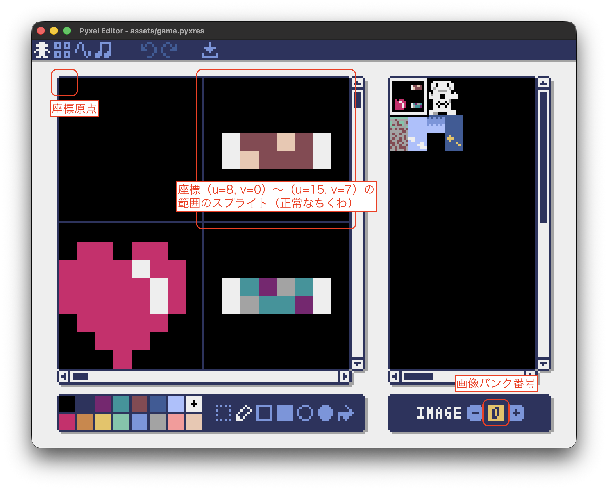

# ちくわゲームの説明

このプロジェクトは Pyxel を使ったシンプルなちくわゲームです。
各ソースコードファイルおよびアセットファイルの役割をまとめます。

## Table of Contents
- [Python ファイル](#python-ファイル)
  - [game.py](#gamepy)
  - [background.py](#backgroundpy)
  - [player.py](#playerpy)
  - [chikuwa.py](#chikuwa.py)
  - [collision.py](#collisionpy)
  - [hud.py](#hudpy)
- [アセットファイル](#アセットファイル)
  - [assets/game.pyxres](#assetsgamepyxres)
- [実行方法](#実行方法)
  - [server.pyを使用したワンクリック実行](#serverpyを使用したワンクリック実行)
  - [Pyxelアプリの実行](#pyxelアプリの実行)
  - [HTML化の手順](#html化の手順)
  - [アプリサーバーの立て方](#アプリサーバーの立て方)


## Python ファイル

### game.py
メインのゲームアプリケーションです。
- Pyxel の初期化とリソース読み込みを行う
- `Player` / `Chikuwa` を生成する
- `pyxel.run()` に `update()` / `draw()` を渡してゲームループを開始する
- `update()` で各オブジェクトの状態更新を行う
- `draw()` で背景・プレイヤー・ちくわ・HUDを順に描画する

### background.py
ゲームの背景描画を担当するクラスです。
- `Background` クラスを定義
- `draw()` でタイルマップを画面全体に描画する

### player.py
プレイヤーキャラクターを管理するクラスです。左右入力に応じて横移動し、その位置にスプライトを描画します。
- `Player` クラスを定義
- `__init__()`
	- 画面サイズ 128x128 を前提に、プレイヤーの初期座標（`x`, `y`）を設定する
	- `y` は地面付近になるように、画面下からのオフセットで指定する
- `update()`
	- Pyxel の入力 API（`pyxel.btn(pyxel.KEY_LEFT/RIGHT)`）を使って左右キー入力を取得する
	- 左右キーが押されている間だけプレイヤーの `x` 座標を加算／減算し、1 フレームあたり 2px ずつ移動させる
	- `x > 0` と `x < 128 - 14` という条件で画面端からはみ出さないように移動範囲を制限する（スプライト幅 16px を考慮）
- `draw()`
	- 画像バンク0の `(u=16, v=0)` に用意した 16x16px のスプライトをプレイヤーとして描画する
	- `self.y - 8` のように少し上にずらして描画することで、足元が地面タイルと自然に合うように調整する
	- `colkey=0` を指定してパレット0番（背景色）を透過させる

### chikuwa.py
落下するちくわオブジェクトを管理するクラスです。ランダムな位置と種類で生成され、一定速度で落下し、条件を満たすと再生成されます。
- `Chikuwa` クラスを定義
- `__init__()`
	- 画面幅 128px を前提に、`x` 座標を `4 〜 128-4` の範囲でランダムに決める（スプライト幅 8px を考慮）
	- `y` を 0（画面上端付近）に設定し、上から落ちてくる動きを表現する
	- 落下速度 `speed` を 2px/フレームに設定する
	- `type` を `0` または `1` からランダムに選び、通常ちくわ（normal）と腐ったちくわ（rotten）などのバリエーションに使う
	- `exits` フラグ（存在フラグ）を `True` にしておき、外部から `False` にすると「消えた」とみなされるようにする
- `update()`
	- 毎フレーム `y += speed` で下方向へ移動させる
	- `y` が画面下端付近（ここでは `128 - 20`）を越えた場合、地面へ落ちたとみなして `create()` を呼び出し再生成する
	- あるいはゲーム側の処理で `exits` が `False` にされた場合（例: プレイヤーと当たった場合）も `create()` によって再生成する
- `_apply_type()`
	- `type` の値に応じてスプライトの縦オフセット `sprite_v` を切り替える
	- `type == 0` のときは `sprite_v = 0`（通常ちくわ）、`type == 1` のときは `sprite_v = 8`（腐ったちくわ）といった形で画像上のパターンを分ける
- `create()`
	- ちくわが画面の下に落ちきったときや、衝突などで消えたときに呼ばれる再生成処理
	- `y` を 0 に戻し、`x` と `type` を再度ランダムに設定して、新しいちくわとして再利用する
	- `exits` を `True` に戻し、「画面内に存在している」状態にする
- `draw()`
	- まず `_apply_type()` を呼び出して、現在の `type` から正しいスプライト位置（`sprite_v`）を設定する
	- 画像バンク0の `(u=8, v=sprite_v)` に配置した 8x8px のちくわスプライトを、`(self.x, self.y)` に描画する
	- `colkey=0` によって背景色を透過させ、タイルマップや他のオブジェクトの上に自然に重ねて表示する

### collision.py
当たり判定を管理するモジュールです。矩形同士の衝突を判定します。
- `check_collision(rect1, rect2)` 関数を定義
  - 2つの矩形（`(x, y, width, height)` のタプル）を引数に取り、衝突しているかを `bool` で返す
  - 衝突判定は AABB（Axis-Aligned Bounding Box）方式を使用し、x/y 軸それぞれで重なりをチェックする
  - ゲーム内でプレイヤーとちくわの衝突判定などに使用する

### hud.py
画面上部にHUD（ヘッドアップディスプレイ）を表示するモジュールです。
- `draw(score: int, lives: int)` 関数を定義
- 左上にハート（残機）を複数表示する
- 右上にスコアを数字のみで表示する

## アセットファイル

### assets/game.pyxres
Pyxelのリソースファイルです。
- スプライト / タイルマップ / サウンド / ミュージック などを定義
- スプライトの中身のイメージ


## スクリプトを利用したアプリの実行方法

### server.pyを使用したワンクリック実行
`server.py`は、PyxelアプリのHTML化からローカルサーバーの起動までを自動化するスクリプトです。HTML化の手順とアプリサーバーの立て方をまとめて実行できます。
- **実行方法**:
  ```bash
  python3 server.py <file_name>.py
  ```
  - スクリプトが自動で`pyxel package`と`pyxel app2html`を実行し、指定したPythonファイル名に基づいたHTMLファイルを生成します。
  - その後、ローカルサーバーがポート8000で起動します。
  - ブラウザで`http://localhost:8000/`を開くと、アプリが実行されます（Codespacesの場合はポートフォワーディングURLを使用）。
  - サーバーを停止するにはCtrl+Cを押してください。

> [!WARNING]
> **Codespace環境での注意**: Codespaceはクラウド上のコンテナ環境のため、`localhost`ではアクセスできません。サーバーを起動後、VS Codeのポートビューでポート8000を公開し、提供されたURL（例: `https://xxxxx-8000.app.github.dev`）を使用してブラウザでアクセスしてください。

## スクリプトを利用しないアプリの実行方法

### Pyxelアプリの実行
1. Pyxelがインストールされていることを確認してください（`pip install pyxel`）。
2. ターミナルで以下のコマンドを実行:
   ```bash
   pyxel run game.py
   ```
   - ゲームウィンドウが開き、ちくわゲームが開始されます。

> [!WARNING]
> **Codespace環境での注意**: CodespaceではGUIウィンドウが表示されないため、この実行方法は適用できません。代わりにHTML化の手順を使用してWebブラウザで実行してください。

### HTML化の手順
PyxelアプリをWebブラウザで実行可能なHTMLファイルに変換するには、以下の手順を実行してください。
1. Pyxelがインストールされていることを確認。
2. ターミナルで以下のコマンドを実行:
   ```bash
   pyxel package . game.py
   ```
3. ターミナルで以下のコマンドを実行:
   ```bash
   pyxel app2html game.pyxapp
   ```
   - これにより、`pyxel-dev.html`ファイルが生成されます。
4. 生成された`pyxel-dev.html`をWebブラウザで開くと、アプリが実行されます（ローカルサーバー経由で開くことを推奨）。

### アプリサーバーの立て方
HTML化したアプリをローカルでテストするには、簡易HTTPサーバーを立ててください。
- **標準のPythonサーバー**:
  ```bash
  python3 -m http.server 8000
  ```
  - ブラウザで`http://localhost:8000/pyxel-dev.html`を開きます。
